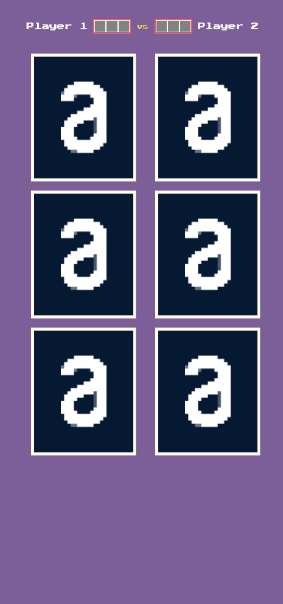

# <div align="center"> Matching Game - Javascript vanilla modules  </div>


<h3>Desktop</h3>
<a href="https://hudson3384-matchinggame.vercel.app/">
</a>

<h3>Mobile</h3>
<a href="https://hudson3384-matchinggame.vercel.app/">
</a>


<p align="center">A Responsive Matching Game made with HTML, CSS and JS modules.</p>

## 🛠️ Technologies

<ul>
  <li><a href="https://vitejs.dev/">Vite</a></li>
</ul>

## ⚙️ Requirements

<ul>
  <li><a href="https://git-scm.com/">Git</a></li>
  <li><a href="https://nodejs.org/en/">Node.js</a></li>
  <li><a href="https://www.npmjs.com/">NPM</a></li>
</ul>

## 🚀 Installation

```
$ git clone https://github.com/Hudson3384/Matching-game-js.git

```

## Author

 [<br><sub>Hudson Arruda Ribeiro</sub>](https://github.com/hudson3384)
